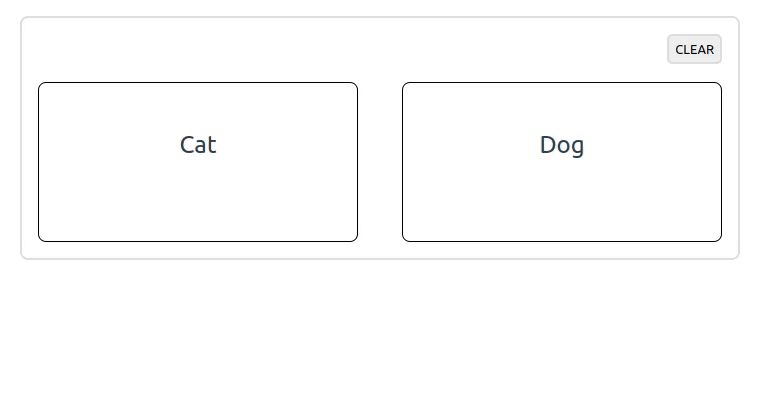

# Cats vs dogs

## Preview



## Technologies used

- PHP 8.2
- PostgreSQL 15.1
- Composer 2.4

## Instructions

1. Clone this repository and navigate to its directory by using the commands:
    ```
    git clone https://github.com/tomskoralis/cats-vs-dogs
    cd cats-vs-dogs/
    ```
2. Install the required packages using the command:
    ```
    composer install
    ```
3. Make a copy of the `.env.example` and rename the copy to `.env` by using the command:
    ```
    cp .env.example .env
    ```
4. Create a new PostgreSQL database and create the table by using the commands:
    ```
    createdb cats-vs-dogs
    psql cats-vs-dogs < database.sql
    ```
5. Enter the PostgreSQL credentials in the `.env` file. The variables are: `DB_USER` and `DB_PASSWORD`.
6. Start the local development server by using the command:
    ```
    php -S 127.0.0.1:8000 -t public/
    ```
7. Test the application by opening it in the browser using the URL http://127.0.0.1:8000
